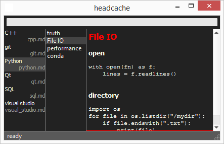
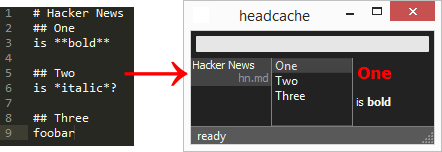
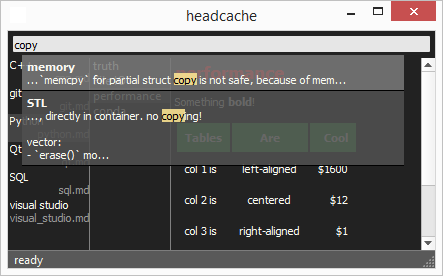
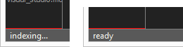
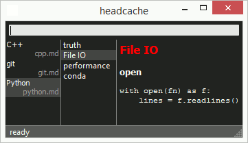

# headcache
headcache is a note program written in Python(3) and PyQt (5). 

It was designed to have a minimal and intuitive interface, for quick navigation and instant search as well as rendered markdown preview

## installation and use
Install with
 
    pip install headcache

and run it in a directory of your choice with `headcache` from the command line (or an appropriate shortcut). It looks for `.md` files that have one H1 headline, and splits the content of each file in h2 chunks.

Since text editing is a very personal choice, headcache does not contain a text editor! To add or change your notes, use an external editor. File changes are instantly loaded into the program. A **double click on any file will open it in the default text editor**. Saving will triger an instant update to navigation, preview and the search index.

The escape key can be used to quickly jump to search (and back). All file contents are indexed, searches are instant and a return on any match will jump to the appropriate information.

The search index is being kept up to date with file changes. Initial indexing at program start may take a second or so, but is done on a separate thread and doesn't block the main program.
 

Navigation between search bar, file list, part list and preview can also be done with tab/shift-tab. A tiny red line at the bottom of each pane indicates the current focus.

All the usual markdown is supported, including tables and images. Links are opened in the default system browser.

headcache writes a `headcache_config.json` on exit that can be edited. `search_text_weight` and `search_title_weight` set the relative search weights for body and title of the markdown files. A big title weight will push search matches in the title higher up.

## todo
- new file dialog
- handle file renames
- icon, some styling (light theme?)
- tag support?
- better context for search matches
- LaTeX support?
- maybe reuse search index